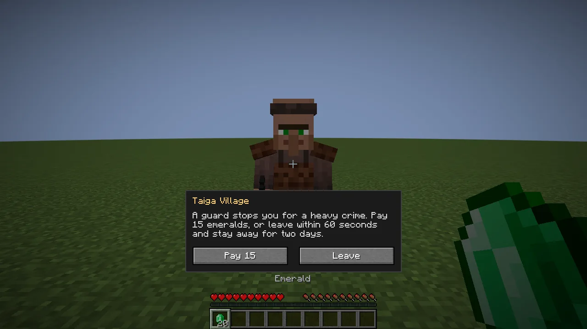
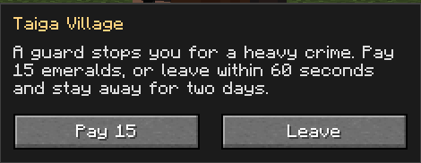
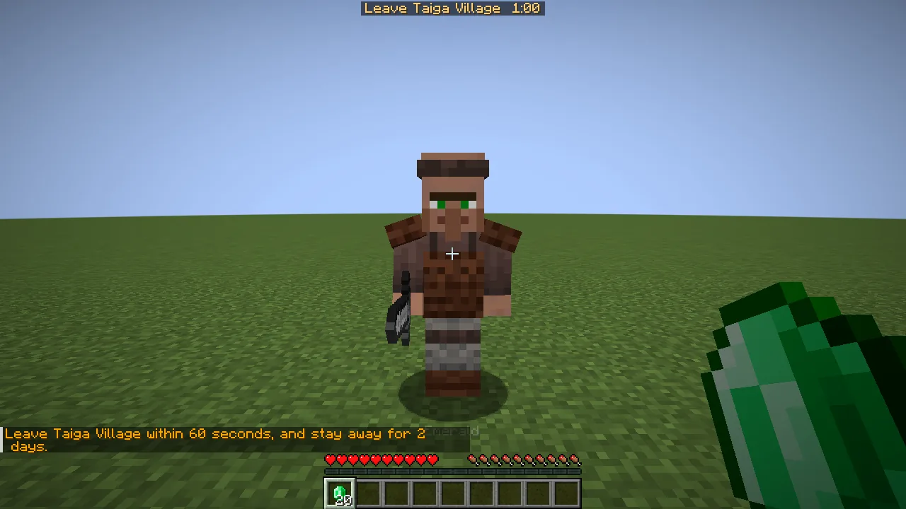
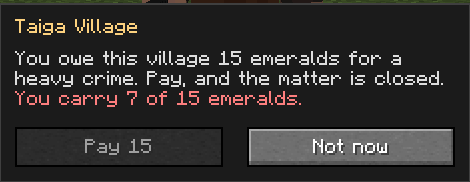

Village guards keep the law the way Skyrim's do. A guard who sees you commit a crime doesn't
attack. He **runs over and stops you** with a choice: **pay the fine**, or **leave within 60
seconds and stay away for two days**.

## What happens

1. **A crime.** Thief decides what's a crime and who saw it: opening a village's chests, breaking
   its bell, killing its animals. When a guard sees a crime that's serious enough, you have a
   **case** with that village. The fine depends on the crime: **3, 8 or 15 emeralds** for a light,
   medium or heavy one. More crimes before it's settled add to the fine. A crime only villagers saw
   costs you their good opinion and nothing more.
2. **The summons.** The guard who saw it runs to you as fast as you sprint. Within three blocks he
   stops you and a screen opens: the village, the crime, the fine, **[Pay]** and **[Leave]**. If you
   can't afford it, [Pay] is greyed out. Pressing Escape counts as Leave, and so does walking away
   before he reaches you. While your case is open and peaceful, the village's guards and golems
   won't attack you.
3. **Pay.** The fine comes out of everything you carry, backpacks included: emeralds first, then
   blocks of emerald, with change. The case is closed, and the whole village forgets the bad things
   it heard about you (and only you).
4. **Leave.** A countdown appears at the top of the screen. Get out of the village's surroundings
   (its bounds plus 32 blocks) before it runs out, and you're **banished for two Minecraft days**
   (40 minutes), still owing the fine.
5. **Stay**, and when the countdown hits 0:00 every guard and golem of the village attacks you until
   you leave or die. The banishment starts from that moment.
6. **Banished.** Come back within the two days and the guards attack while you're inside. Once the
   two days are up they leave you alone. **Right-click any of the village's guards** to pay what you
   owe and have it forgiven.

## Good to know

- **Hitting a guard is still a fight.** If you've hurt a villager, a guard or a golem in the last
  five seconds, they can fight you whatever your case.
- **No case at all** for the owner of a village bought with [Village Deed](/wiki/village-deed) and
  the players they trust, for a Hero of the Village, or in creative.
- **Guards run at a sprinting player's speed.** Guard Villagers' own guards were faster than that;
  every guard is corrected as it loads.
- Taking a villager captive with [Serfdom](/wiki/serfdom)'s chain is a heavy crime: paying that
  case's fine frees the captives you took in it.

